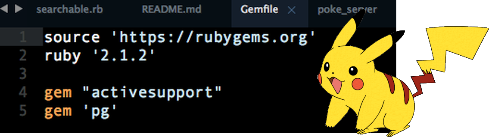

## Pokedex on MagLev
A Responsive Pokedex built using only Webrick and ActiveSupport
View it live [here](https://pokedex-sans-rails.herokuapp.com/pokemon)

### Features of MagLev

#### SQLObject model class 
- Extends a searchable module to provide where and find methods
- Extends an associatable module to provide association macros

#### Macros for defining model associations
- Support has_many, belongs_to, has_one_through, and has_many_through relationships
- Allow overriding of foreign key or class name values but merge sensible (rails-like)
defaults if none are provided

#### BaseController class 
- Reads and writes to session cookies and supports flash and flash.now
- Wraps views in a customizable header partial to support scripts and stylesheet loading
while keeping views DRY  
- Integration of the BaseController and SQLObject classes allow

#### A gemfile that is loved by all

#### Asset image, script, and stylesheet support
- A controller for each type of asset and corresponding routes using regexps to support get requests from within your project directory.
- Image routes will recognize and respond to .jpg, .jpeg, and .png files
- ScriptsController recognizes .js files in the src of script tags and runs the appropriate files
- StyleSheetsController does the same for linked stylesheets

### Plans for the Near Future
- Incorporate an includes method for SQLObject to get rid of the only thing worse than team rocket
- Either provide full support for rendering partials or integrate Backbone